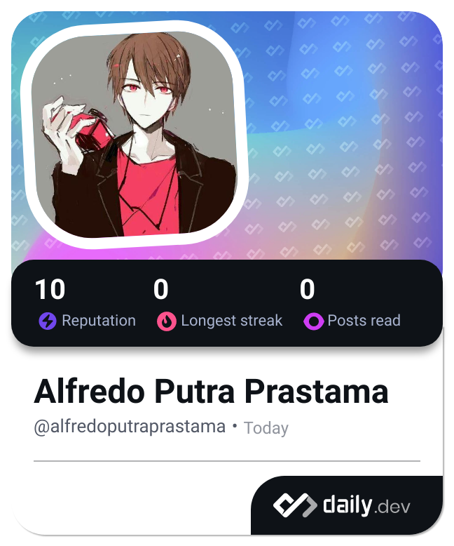

<h1 align="left">Hai 👋 Selamat Datang Di Profilku</h1>

###

Namaku Alfredo, senang melihatmu apalagi bisa berbisnis denganmu 🤫

###

###

  

###

  
  
  
  

###

<h2 align="left">Tentang Aku</h2>

###

✨ Menciptakan bug sejak menjadi mahasiswa UBSI 📚 Sedang mempelajari Informatika – Fakultas Teknik & Informatika 🎯 Tujuan: Menjadi Front-End Developer & Web Developer yang andal 🎲 Fakta unik: Suka ngoprek kode sampai lupa waktu ☕💻

###

<h2 align="left">Beberapa teknologi web dan bahasa untuk pengembangan front-end yang sedang ku dalamin</h2>

###

  
  
  
  
  
  
  
  
  
  
  

###

<h2 align="left">Gambaran statistik ku dalam belajar membuat project</h2>

###

  
  

###

###

<h2 align="left">Dan beberapa tampilan menarik lainnya</h2>

###

  
  
  

###

###